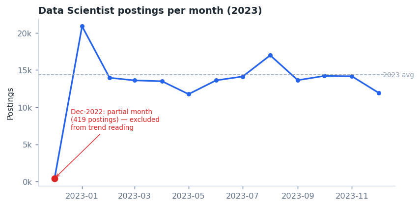
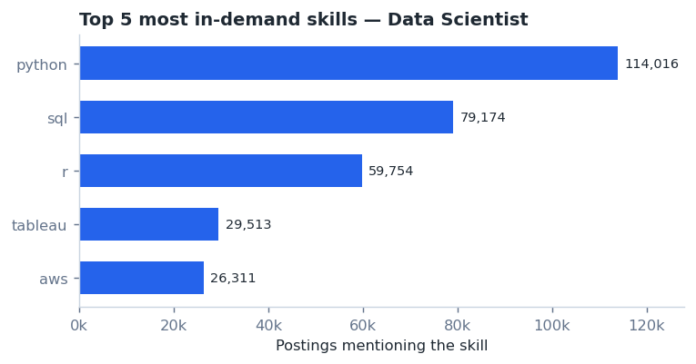
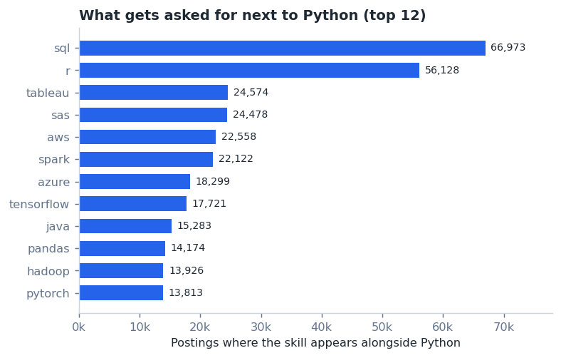
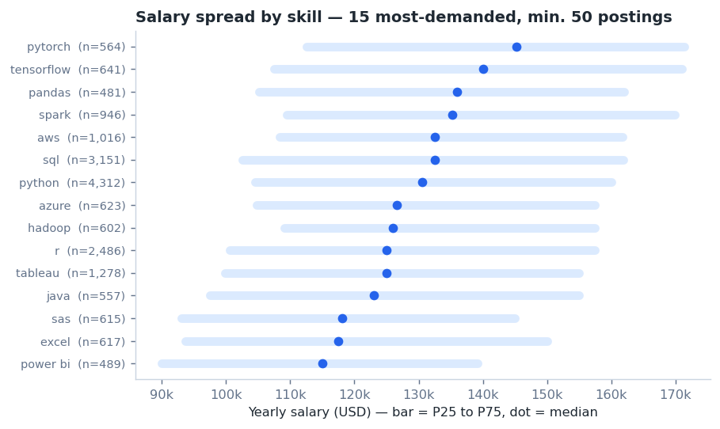
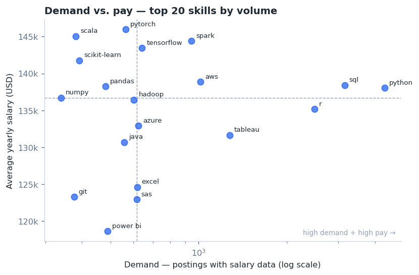

# Data Scientist Job Market — A SQL Analysis

*[Leer en español](README.es.md)*

Exploring the 2023 data job market for **Data Scientist** roles with PostgreSQL: how demand moved
over the year, which skills the market actually asks for, how they combine, and where pay and
demand overlap. Along the way, a data-quality bug surfaced that changed two of the results —
that's documented rather than hidden, since finding it was the more interesting part of the work.

## Questions

| # | Question | Technique |
|---|---|---|
| 1 | Is demand growing or shrinking through 2023? | `DATE_TRUNC` + `LAG()` |
| 2 | Which skills are asked for most often? | dedup + `GROUP BY` |
| 3 | Which skills get asked for alongside the top skill? | self-join + scalar subquery |
| 4 | Which remote postings pay the most? | filter + `ORDER BY` |
| 5 | What skills do those top-paying postings list? | CTE as filtered base |
| 6 | Highest average salary by skill? | `AVG()` — and why the answer is misleading |
| 7 | What does the salary *distribution* look like? | `PERCENTILE_CONT` + `HAVING` |
| 8 | High demand **and** high pay? | two CTEs joined together |

6 → 7 → 8 are meant to be read in order: 6 asks a naive question, 7 corrects it, 8 combines it
with demand.

## Data

This public dataset contains approximately 787,000 job postings published from December 2022
through the end of 2023, spread across three tables:

- `job_postings_fact` — one row per posting
- `skills_dim` — skill catalogue
- `skills_job_dim` — bridge table (many-to-many between postings and skills)

Scope is `job_title_short = 'Data Scientist'`. Salary questions use only postings where
`salary_year_avg IS NOT NULL` — about 1 in 25 postings.

---

## Findings

### 1. Demand was flat-to-declining across 2023



January opens at ~20,900 postings, December closes at ~11,900 — a 43% drop across the year. It's
not a straight line: February alone drops 33%, the middle of the year oscillates in a ±20% band
around ~13,500/month, and August spikes +20%.

The 4,882% jump shown from December 2022 to January 2023 is an artefact: December 2022 has only
419 postings, a partial month at the edge of the scrape. Excluded from the trend reading.

<details>
<summary>View SQL — <code>01_market_trend_monthly.sql</code></summary>

```sql
WITH monthly_count AS (
    SELECT 
        DATE_TRUNC('month',job_posted_date)::date AS month_posted,
        COUNT(job_id) AS job_count
    FROM job_postings_fact
    WHERE job_title_short = 'Data Scientist'
    GROUP BY month_posted 
    ORDER BY month_posted ASC
    ), with_lag AS (
    SELECT 
        month_posted,
        job_count,
        LAG(job_count) OVER (ORDER BY month_posted) AS previous_month_count
FROM monthly_count
    )

SELECT
    month_posted,
    job_count,
    previous_month_count,
    (job_count - previous_month_count) AS abs_var,
    ROUND(((job_count - previous_month_count)::NUMERIC/previous_month_count::NUMERIC) * 100,2) AS relative_var
FROM with_lag
```
</details>

### 2. Python, SQL and R are the non-negotiables — AWS edges out SAS for #5



Python leads with 114,016 postings, ahead of SQL (79,174) and R (59,754) — nearly a 4× gap to #4.
Tableau (29,513) and **AWS (26,311)** round out the top 5.

SAS originally looked like it belonged in 5th place with 29,642 — it doesn't. See
[Data quality](#data-quality-duplicate-skill-ids) below.

<details>
<summary>View SQL — <code>02_most_in_demand_skills.sql</code></summary>

```sql
WITH job_skill AS (
    SELECT DISTINCT
        sj.job_id,
        sd.skills
    FROM skills_job_dim sj
    INNER JOIN skills_dim sd ON sj.skill_id = sd.skill_id
    INNER JOIN job_postings_fact jpf ON sj.job_id = jpf.job_id
    WHERE jpf.job_title_short = 'Data Scientist'
)

SELECT
    skills,
    COUNT(*) AS demand_count
FROM job_skill
GROUP BY skills
ORDER BY demand_count DESC
LIMIT 5
```
</details>

### 3. Python is a hub, not a standalone skill



66,973 postings that ask for Python also ask for SQL; 56,128 also ask for R. Python is almost
always requested in combination. Two clusters show up: an **analytics stack** (SQL, R, Tableau)
and a **data-engineering/ML stack** (AWS, Spark, Azure, TensorFlow, Hadoop) — both anchored to
Python.

<details>
<summary>View SQL — <code>03_skill_co_occurrence.sql</code></summary>

```sql
WITH job_skill AS (
    SELECT DISTINCT
        sj.job_id,
        sd.skills
    FROM skills_job_dim sj
    INNER JOIN skills_dim sd ON sj.skill_id = sd.skill_id
    INNER JOIN job_postings_fact jpf ON sj.job_id = jpf.job_id
    WHERE jpf.job_title_short = 'Data Scientist'
)

SELECT
    js1.skills AS skill_a,
    js2.skills AS skill_b,
    COUNT(*) AS co_occurrence_count
FROM job_skill js1
    INNER JOIN job_skill js2 ON js1.job_id = js2.job_id AND js1.skills <> js2.skills
WHERE js1.skills = (
    SELECT js.skills
    FROM job_skill js
    GROUP BY js.skills
    ORDER BY COUNT(*) DESC
    LIMIT 1
)
GROUP BY js1.skills, js2.skills
ORDER BY co_occurrence_count DESC
```
</details>

### 4–5. The top-paying postings tell us very little

The highest remote salary in scope is $550,000/yr (SQL + Python), followed by $525,000 — which
lists only SQL as a required skill, nothing else. Of the true top 10, 7 have any skills listed at
all (the join drops the rest). This is a sample of 10. Not enough to generalize from — which is
exactly why questions 6–8 exist.

<details>
<summary>View SQL — <code>04_top_paying_jobs.sql</code> / <code>05_skills_in_top_paying_jobs.sql</code></summary>

```sql
SELECT 
    job_id,
    job_title_short,
    job_location,
    job_schedule_type,
    ROUND(salary_year_avg,0) AS avg_yearly_salary,
    job_posted_date::date
FROM job_postings_fact
WHERE job_location = 'Anywhere' 
     AND job_title_short = 'Data Scientist'
     AND salary_year_avg IS NOT NULL
ORDER BY salary_year_avg DESC


WITH top_DS_paying_jobs AS (
        SELECT 
            job_id,
            job_title_short,
            ROUND(salary_year_avg,0) AS avg_yearly_salary
        FROM job_postings_fact
        WHERE job_location = 'Anywhere' 
            AND job_title_short = 'Data Scientist'
            AND salary_year_avg IS NOT NULL
        ORDER BY salary_year_avg DESC
        LIMIT 10
        )
SELECT 
        tpj.*,
        sd.skills
FROM top_DS_paying_jobs tpj
INNER JOIN skills_job_dim sj
            ON tpj.job_id = sj.job_id
INNER JOIN skills_dim sd
            ON sj.skill_id = sd.skill_id
```
</details>


### 6–7. Average salary is noise; the distribution is the real answer

Ranking skills by average salary with no volume filter gives: asana ($215k), airtable ($201k),
redhat ($189k), watson ($187k), elixir ($171k) — none of them real data science skills, each
backed by a handful of postings where one outlier salary sets the whole average. This is the
failure mode this project is built to demonstrate.

<details>
<summary>View SQL — <code>06_avg_salary_by_skill.sql</code> (the naive version)</summary>

```sql
SELECT 
    sd.skills,
    ROUND(AVG(salary_year_avg),0) AS avg_salary
FROM job_postings_fact jpf
INNER JOIN skills_job_dim sj
            ON jpf.job_id = sj.job_id
INNER JOIN skills_dim sd
            ON sj.skill_id = sd.skill_id
WHERE jpf.job_title_short = 'Data Scientist' 
      AND salary_year_avg IS NOT NULL
GROUP BY sd.skills
ORDER BY avg_salary DESC
LIMIT 20
```
</details>

Add a floor of 50+ postings and look at the full distribution instead of just the mean:



- **The mean sits above the median for every skill checked** — Python $138k vs $130.5k, R $135k
  vs $125k, Hadoop $136k vs $126k. Salaries are right-skewed: a few big offers pull the mean up.
  Reporting the mean alone overstates a typical offer.
- The overstatement isn't uniform — R and Hadoop run ~8% high, PyTorch only 0.5%. So the *ranking*
  by mean is distorted too, not just the levels.
- Top medians go to infrastructure/ML tooling: Airflow ($157k), BigQuery ($150k), Looker ($147.5k),
  PyTorch ($145k) — all above Python's own median ($130.5k).
- Spread matters too: most skills sit in a $50–60k IQR band. Express ($82.6k IQR, n=89) and Shell
  ($73.5k, n=63) are much wider — a "high median" there is far less reliable than the same number
  for Python (n=4,312).

<details>
<summary>View SQL — <code>07_salary_distribution_by_skill.sql</code> (the fix)</summary>

```sql
SELECT 
    sd.skill_id,
    sd.skills,
    COUNT (sj.job_id) AS demand_count,
    PERCENTILE_CONT(0.25) WITHIN GROUP (ORDER BY salary_year_avg) AS p25_salary,
    PERCENTILE_CONT(0.5) WITHIN GROUP (ORDER BY salary_year_avg) AS median_salary,
    PERCENTILE_CONT(0.75) WITHIN GROUP (ORDER BY salary_year_avg) AS p75_salary
FROM job_postings_fact jpf
        INNER JOIN skills_job_dim sj
                    ON jpf.job_id = sj.job_id
        INNER JOIN skills_dim sd
                    ON sj.skill_id = sd.skill_id
WHERE job_title_short = 'Data Scientist'
      AND salary_year_avg IS NOT NULL
GROUP BY sd.skill_id, sd.skills
HAVING COUNT (sj.job_id) > 50
ORDER BY median_salary DESC
```
</details>

*Note: this query groups by `skill_id`, so a duplicated skill (see below) shows up as two rows
with identical numbers — cosmetic here, unlike question 2.*

### 8. High pay and high demand are close to independent



Python leads demand by an order of magnitude while sitting mid-table on pay. The genuinely
attractive cluster is **Spark, AWS, TensorFlow, PyTorch, scikit-learn** — 400–1,000 postings each,
$138k–$146k average. High enough volume to be a real market, high enough pay to be worth learning.
Excel and Power BI have solid demand but weak pay; SAS is the weakest of the high-volume skills on
both axes.

<details>
<summary>View SQL — <code>08_optimal_skills.sql</code></summary>

```sql
WITH skills_demand AS (
        SELECT 
            sd.skill_id,
            sd.skills,
            COUNT (sj.job_id) AS demand_count
        FROM job_postings_fact jpf
        INNER JOIN skills_job_dim sj
                    ON jpf.job_id = sj.job_id
        INNER JOIN skills_dim sd
                    ON sj.skill_id = sd.skill_id
        WHERE jpf.job_title_short = 'Data Scientist'
            AND salary_year_avg IS NOT NULL
        GROUP BY sd.skill_id
        ), avg_salary AS(
        SELECT 
            sd.skill_id,
            sd.skills,
            ROUND(AVG(salary_year_avg),0) AS avg_salary
        FROM job_postings_fact jpf
        INNER JOIN skills_job_dim sj
                    ON jpf.job_id = sj.job_id
        INNER JOIN skills_dim sd
                    ON sj.skill_id = sd.skill_id
        WHERE jpf.job_title_short = 'Data Scientist' 
            AND salary_year_avg IS NOT NULL
        GROUP BY sd.skill_id
        )

SELECT
    ss.skill_id,
    ss.skills,
    demand_count,
    avg_salary
FROM
    skills_demand ss
INNER JOIN avg_salary a ON ss.skill_id = a.skill_id
WHERE demand_count > 10
ORDER BY demand_count DESC, avg_salary DESC
LIMIT 20;
```
</details>

---

## Data quality: duplicate skill IDs

Two identical rows in an early co-occurrence result (same pair, same count, twice) led to this
check:

```sql
SELECT skills, COUNT(*) AS id_count
FROM skills_dim
GROUP BY skills
HAVING COUNT(*) > 1;
```

**Seven skill names each have two different `skill_id` values:** `sas`, `mongodb`, `ruby`,
`firebase`, `powerbi`, `sqlserver`, `asp.netcore`. Postings appear linked to both ids of the same
name — confirmed because grouping by `skill_id` produces two rows with byte-identical figures
(e.g. `sas` shows demand 615 and median $118,080 under two different ids).

**Fix:** a `job_skill` CTE that does `SELECT DISTINCT job_id, skill_name` before any join or
aggregation, collapsing both ids into one row per posting. Used in questions 2 and 3.

**Result:** SAS's true demand is ~14,821, not 29,642 — it drops out of the top 5 skills, replaced
by AWS. `python↔sas` co-occurrence drops from 24,478 to 12,239 (exactly half, as expected).


---


## What I took away from this

The hardest query to write (the self-join in question 3) was also the one that exposed a bug that
had been quietly inflating question 2 all along. A few things worth keeping:

1. An aggregate with no volume floor is a random number generator — `HAVING COUNT(*) > 50` did
   more for this analysis than any window function in it.
2. Mean and median disagreeing is information, not an inconvenience — it's what tells you a
   distribution is skewed.
3. Two identical rows are worth stopping for.

---


## Conclusion

Putting the eight findings together: demand for Data Scientist roles softened over 2023, but the
skills that matter didn't change. Python, SQL and R remain the entry ticket — almost always
requested together, never in isolation. Beyond that baseline, the highest-value additions are
cloud and ML tooling (AWS, Spark, TensorFlow, PyTorch) — demanded enough to be a real market, paid
well enough to justify learning them.


## Repo structure

```
sql-project-data-scientist/
├── README.md
├── queries/
│   ├── 00_data_quality_checks.sql
│   ├── 01_market_trend_monthly.sql
│   ├── 02_most_in_demand_skills.sql
│   ├── 03_skill_co_occurrence.sql
│   ├── 04_top_paying_jobs.sql
│   ├── 05_skills_in_top_paying_jobs.sql
│   ├── 06_avg_salary_by_skill.sql
│   ├── 07_salary_distribution_by_skill.sql
│   └── 08_optimal_skills.sql
└── assets/
    ├── 01_monthly_trend.png
    ├── 02_top_demand_skills.png
    ├── 03_python_cooccurrence.png
    ├── 04_salary_distribution.png
    └── 05_optimal_skills.png
```
